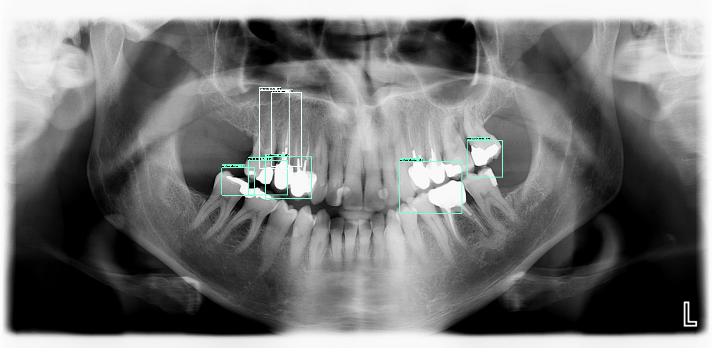
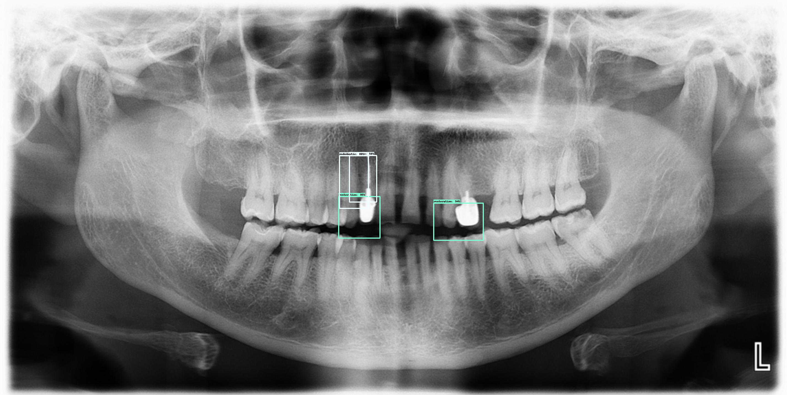
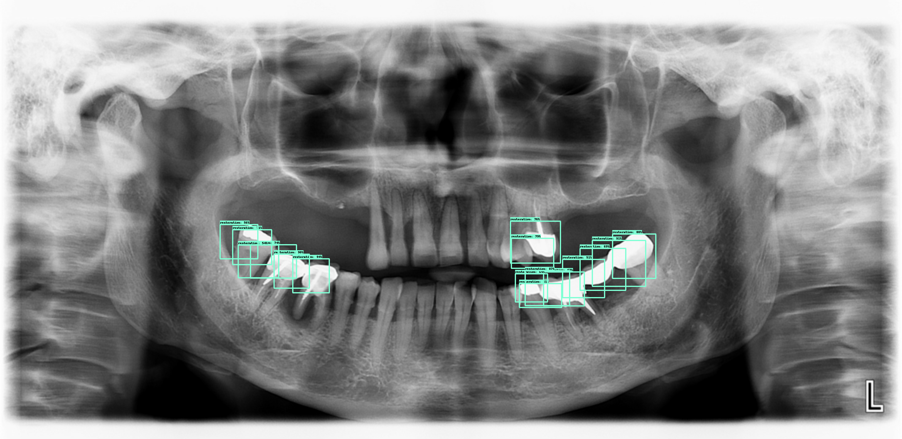

# Teeth detector





Dataset is private for the moment, but was made with a stomatologist surgeon, using VoTT for labeling. The export was made under the `Tensorflow Pascal VOC` format

The project is divided into two tasks:
1. Detect tooth restoration, endodotic treatment and implants (models/treatment)
2. Detect teeth and identify their ISO Dental Notation (models/index)


## Installation

- Download the datasets from the google drive (datasets are private at the moment)
- Install tensorflow object detection: https://github.com/tensorflow/models/blob/master/research/object_detection/g3doc/installation.md
- Install Cloud SDK to run on google cloud https://cloud.google.com/sdk/


```
pip install -r requirements.txt

# Tensorflow Object Detection API
git clone git@github.com:tensorflow/models.git

git clone https://github.com/cocodataset/cocoapi.git
cd cocoapi/PythonAPI
make
cp -r pycocotools <path_to_tensorflow>/models/research/

# From tensorflow/models/research/
export PYTHONPATH=$PYTHONPATH:`pwd`:`pwd`/slim
```


## Training

```
python <path_to_tensorflow>/models/research/object_detection/model_main.py \
    --pipeline_config_path=<path_to_tooth-detection>/tooth-detection/models/treatment/faster_rcnn_resnet50_coco.config \
    --model_dir=<path_to_tooth-detection>/tooth-detection/models/treatment/model \
    --num_train_steps=100000 \
    --alsologtostderr
```

## Inference

```
python inference.py \
    --PATH_TO_FROZEN_GRAPH=<path_to_tooth-detection>/<path_to_frozen_graph>/frozen_inference_graph.pb \
    --PATH_TO_TEST_IMAGES_DIR=<path_to_tooth-detection>/data/iran_index/JPEGImages \
    --PATH_TO_LABELS=<path_to_tooth-detection>/data/pascal_label_map_index.pbtxt
```
