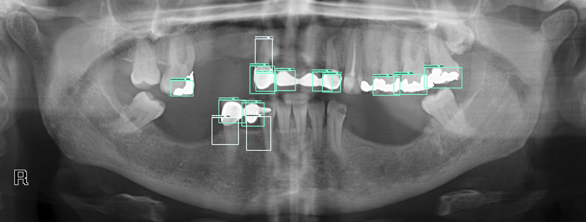

# Teeth detector





Dataset is private for the moment, but was made with a stomatologist surgeon, using VoTT for labeling. The export was made under the `Tensorflow Pascal VOC` format

The project is divided into two parts:
1. Extract the labels from the teeth and train a CNN to identify the tooth number (`train.py`). This was a quick experiment and no effort is currently spent on it
2. Train an object detection pipeline with Tensorflow in order to detect tooth restoration, endodotic treatment and implants


## Installation

- Download the datasets from the google drive
- Git clone https://github.com/tensorflow/models/, and run ```export PYTHONPATH=$PYTHONPATH:`pwd`:`pwd`/slim``` in   `/models/research`


## TODO
- data preprocessing
- configure Object Detection Pipeline
- run a simple model on the data
- run a better model
- automatise installation
- augment dataset, especially for implants


# Commands

```
python ../models/research/object_detection/train.py \
    --logtostderr \
    --pipeline_config_path=/Users/clementjoudet/Desktop/dev/teeth/models/cloud/ssd-local.config \
    --train_dir="/Users/clementjoudet/Desktop/dev/teeth/models/cloud/train"
```

```
python ../models/research/object_detection/eval.py \
    --logtostderr \
    --pipeline_config_path=/Users/clementjoudet/Desktop/dev/teeth/models/cloud/ssd-local.config \
    --checkpoint_dir="/Users/clementjoudet/Desktop/dev/teeth/models/cloud/train/" \
    --eval_dir="/Users/clementjoudet/Desktop/dev/teeth/models/cloud/eval"
```


# Gcloud

Train job
```
gcloud ml-engine jobs submit training tooth_jood_`date +%s` \
    --runtime-version 1.5 \
    --job-dir=gs://tooth-jood/data/ \
    --packages dist/object_detection-0.1.tar.gz,slim/dist/slim-0.1.tar.gz \
    --module-name object_detection.train \
    --config /Users/clementjoudet/Desktop/dev/teeth/models/cloud/cloud.yml \
    --region europe-west1 \
    -- \
    --train_dir=gs://tooth-jood/data/ \
    --pipeline_config_path=gs://tooth-jood/data/ssd.config
```

Stream logs

```
gcloud ml-engine jobs stream-logs JOB_ID
```

Eval job
```
gcloud ml-engine jobs submit training object_detection_eval_`date +%s` \
    --runtime-version 1.5 \
    --job-dir=gs://tooth-jood/data/ \
    --packages dist/object_detection-0.1.tar.gz,slim/dist/slim-0.1.tar.gz \
    --module-name object_detection.eval \
    --region us-central1 \
    --scale-tier BASIC_GPU \
    -- \
    --checkpoint_dir=gs://tooth-jood/data/ \
    --eval_dir=gs://tooth-jood/data/eval/ \
    --pipeline_config_path=gs://tooth-jood/data/ssd.config
```

Cancel job

```
gcloud ml-engine jobs cancel JOB_ID
```

See job list

```
gcloud ml-engine jobs list
```
